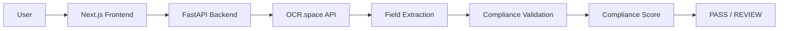
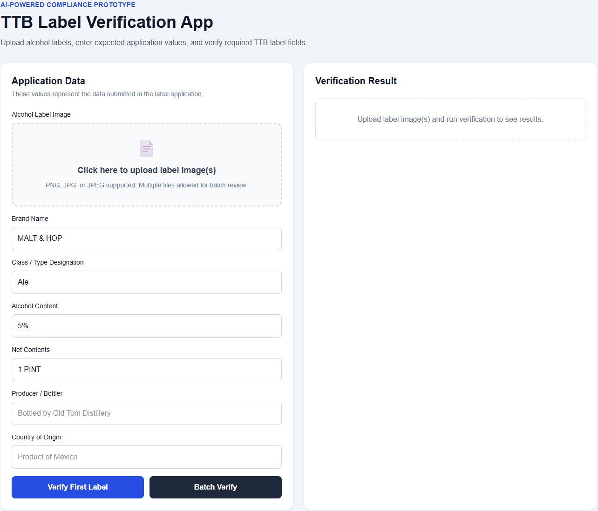
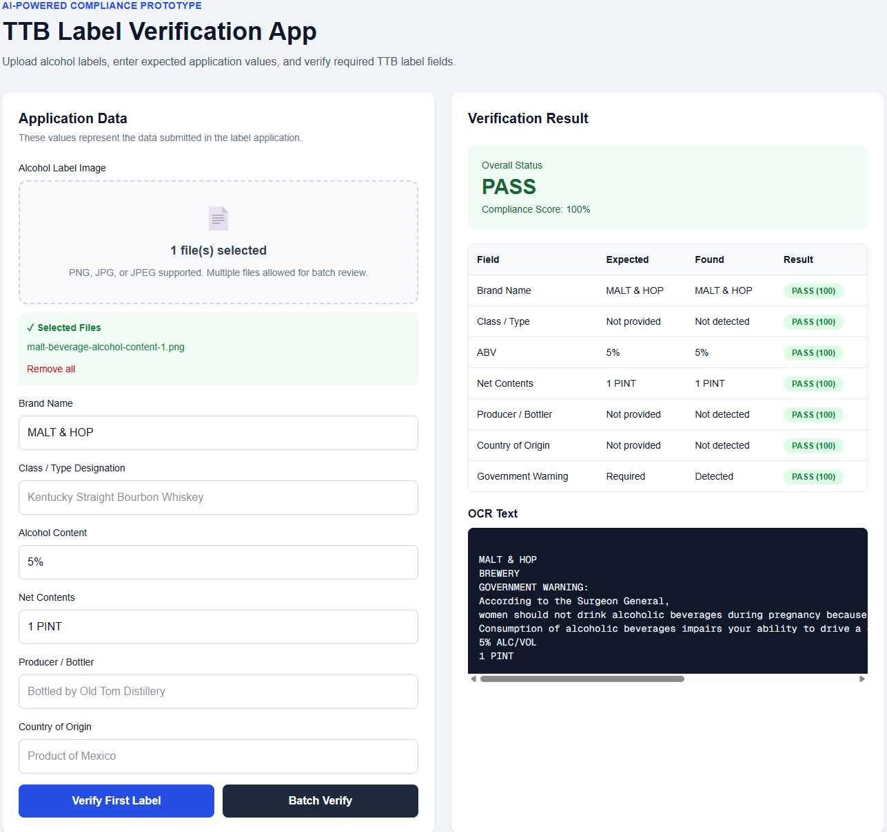
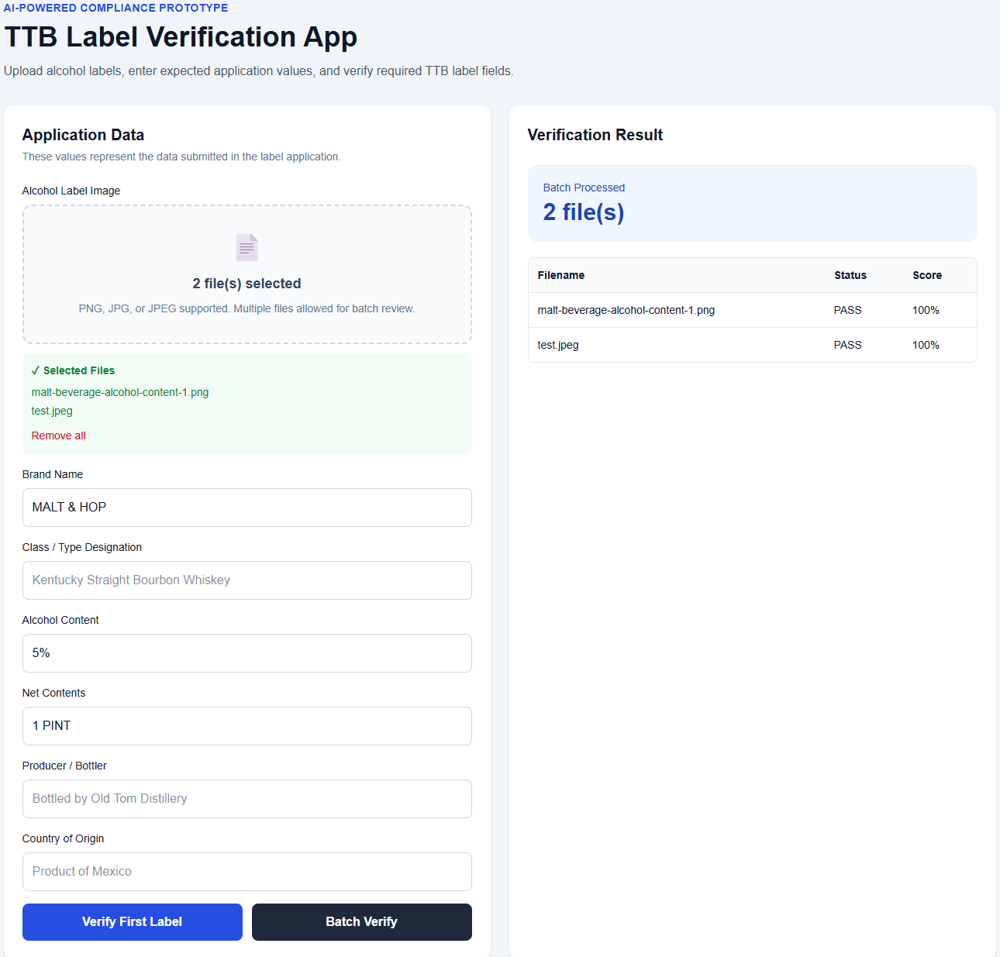

# 🍺TTB Label Verification App

## 📋Executive Summary

The TTB Label Verification App is an AI-assisted compliance review prototype that automates routine alcohol label verification tasks currently performed manually by compliance agents.

The application extracts information from uploaded alcohol label images, identifies required TTB label elements, compares extracted values against submitted application data, and generates compliance recommendations. The solution was designed to reduce manual review effort, improve consistency, and support higher-volume processing workflows while maintaining a simple and intuitive user experience.

---

## 🌐Live Demo

### Frontend Application

https://ttb-label-verification-app.vercel.app

### Backend API

https://ttb-label-verification-app-api.onrender.com

### Source Code Repository

https://github.com/0x01987/ttb-label-verification-app

---

## 🏗️Architecture Diagram



## Design Approach

This prototype was intentionally designed as a lightweight, standalone proof-of-concept rather than a full COLA system integration.

Key design goals included:

* Minimize reviewer effort through automated field extraction and comparison.
* Support non-technical users through a simple, guided interface.
* Provide transparent PASS/REVIEW recommendations rather than opaque AI decisions.
* Maintain fast response times for high-volume review scenarios.
* Demonstrate a deployable architecture that could be expanded for future enterprise integration.

The implementation favors simplicity, maintainability, and reviewer usability over complex machine learning pipelines.

---

## 📸Screenshots

### Upload & Verification



### Verification Results



### Batch Verification



---

## Compliance Review Rules

The application automatically marks a label as REVIEW if any required label element cannot be detected.

Required fields include:

- Brand Name
- Class / Type Designation
- Alcohol Content (ABV)
- Net Contents
- Producer / Bottler Information
- Country of Origin
- Government Health Warning Statement

PASS Criteria:

- All required fields detected
- Government warning detected
- Application comparisons pass when values are provided

REVIEW Criteria:

- Missing required field(s)
- Missing government warning
- Mismatched application data
- OCR unable to identify required information

---

## ⭐Features

- OCR-based label extraction
- Label image preview
- Scan-first workflow
- Required field detection
- Government warning validation
- Application data comparison
- Country of origin normalization
- Missing required field detection
- Compliance scoring
- PASS / REVIEW recommendations
- Batch verification

---

## 🛠️Technology Stack

### Frontend

- Next.js
- React
- TypeScript
- Tailwind CSS

### Backend
- FastAPI
- Python
- RapidFuzz

### OCR
- OCR.space API (hosted)
- EasyOCR (local development)

### Deployment
- Vercel
- Render

---

## 🔄Validation Workflow

1. Upload label image.
2. Preview uploaded label.
3. OCR extracts label text.
4. Required fields are identified.
5. Missing fields are detected.
6. Application data is optionally compared.
7. Compliance score is calculated.
8. PASS or REVIEW recommendation is returned.

---

## ✅Supported Fields

| Field                        | Supported |
| ---------------------------- | --------- |
| Brand Name                   | Yes       |
| Class / Type Designation     | Yes       |
| Alcohol Content              | Yes       |
| Net Contents                 | Yes       |
| Producer / Bottler           | Yes       |
| Country of Origin            | Yes       |
| Government Warning Statement | Yes |
| Missing Required Field Detection | Yes |
| Label Image Preview | Yes |
| Batch Verification | Yes |
| Compliance Scoring | Yes |

---

## 💻Local Development Setup

## Getting Started

Clone the repository:

```bash
git clone https://github.com/0x01987/ttb-label-verification-app.git
```

Navigate to the project directory:

```bash
cd ttb-label-verification-app
```

Follow the Backend Setup and Frontend Setup instructions below to run the application locally.

### 🔧Prerequisites

* Python 3.11+
* Node.js 20+
* npm

### ⚙️Backend Setup

```bash
cd backend
python -m venv venv
.\venv\Scripts\Activate.ps1
pip install -r requirements.txt
uvicorn main:app --reload --host 127.0.0.1 --port 8001
```

API Documentation:

```text
http://127.0.0.1:8001/docs
```

### 🎨Frontend Setup

```bash
cd frontend
npm install
npm run dev
```

Application URL:

```text
http://localhost:3000
```

---

## Stakeholder Requirements Addressed

### Sarah Chen

* Automated label verification
* Simple user interface
* Batch processing support

### Dave Morrison

* Fuzzy matching to reduce false mismatches
* Human review workflow through REVIEW status

### Jenny Park

* Government Warning validation
* Automated extraction of common label elements

### Marcus Williams

* Standalone proof-of-concept
* No dependency on COLA integration
* Cloud-deployable architecture

---

## ⚠️Known Limitations

- Rule-based validation logic.
- OCR accuracy depends on image quality.
- Government warning validation focuses on content detection.
- Prototype does not integrate with COLA.
- OCR.space API availability may affect processing.

---

## Trade-offs

This prototype prioritizes rapid verification of common label elements and workflow automation.

Government warning validation currently focuses on content detection rather than typography, formatting, or placement requirements. These checks could be incorporated in a production implementation using advanced OCR layout analysis.

---

## Assumptions

* Labels are submitted as image files.
* OCR text quality is sufficient for extraction.
* Government warning validation focuses on required content presence.
* Fuzzy matching is appropriate for minor formatting variations.
* Prototype focuses on common TTB-required label elements.
* This application is intended as a proof-of-concept and does not integrate directly with the COLA system.

---

## Deployment Notes

The local development environment uses EasyOCR for OCR extraction and testing.

The hosted application uses OCR.space API for live OCR processing of uploaded label images.

This architecture was selected because OCR.space provides lightweight cloud-based OCR while avoiding the memory constraints associated with hosting EasyOCR and PyTorch on free-tier cloud infrastructure.

The validation engine is OCR-provider agnostic and can be extended to support enterprise OCR services such as Azure AI Vision, Amazon Textract, or Google Vision OCR with minimal changes.

---

## 🔮Future Enhancements

* Production-grade OCR deployment
* Image preprocessing using OpenCV
* Confidence scoring per extracted field
* Label image quality assessment
* Advanced TTB rule validation
* COLA workflow integration
* User authentication and audit logging
* Azure Government deployment
* Agent review dashboard
* Historical review analytics

---

## Design Considerations

The user interface was intentionally designed to support users with varying levels of technical proficiency.

Key goals included:

* Minimal clicks
* Large upload area
* Clear PASS / REVIEW indicators
* Simple data entry
* Fast response times
* Easy batch processing

These design choices were informed by stakeholder interviews and intended to support both experienced and less technical compliance reviewers.

---

## 👤Author

Dinel Bun

TTB Label Verification App Prototype
