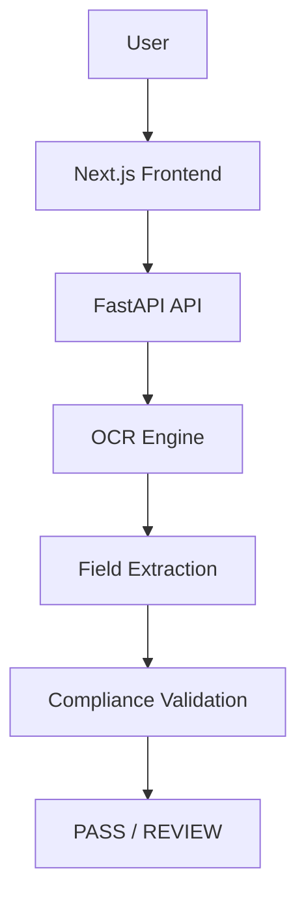

# TTB Label Verification App

## Executive Summary

The TTB Label Verification App is an AI-assisted compliance review prototype that automates routine alcohol label verification tasks currently performed manually by compliance agents.

The application extracts information from uploaded alcohol label images, identifies required TTB label elements, compares extracted values against submitted application data, and generates compliance recommendations. The solution was designed to reduce manual review effort, improve consistency, and support higher-volume processing workflows while maintaining a simple and intuitive user experience.

---

## Overview

The TTB Label Verification App is an AI-assisted prototype designed to help Alcohol and Tobacco Tax and Trade Bureau (TTB) compliance agents review alcohol beverage labels more efficiently.

The application automates portions of the label review process by extracting information from uploaded label images, validating required fields, and comparing extracted values against application data submitted by an applicant.

The goal is to reduce manual verification effort while providing a simple and intuitive user experience for compliance reviewers.

---

## Live Demo

### Frontend Application

https://ttb-label-verification-app.vercel.app

### Backend API

https://ttb-label-verification-app-api.onrender.com

### Source Code Repository

https://github.com/0x01987/ttb-label-verification-app

---

## Design Approach

This prototype was intentionally designed as a lightweight, standalone proof-of-concept rather than a full COLA system integration.

Key design goals included:

* Minimize reviewer effort through automated field extraction and comparison.
* Support non-technical users through a simple, guided interface.
* Provide transparent PASS/REVIEW recommendations rather than opaque AI decisions.
* Maintain fast response times for high-volume review scenarios.
* Demonstrate a deployable architecture that could be expanded for future enterprise integration.

The implementation favors simplicity, maintainability, and reviewer usability over complex machine learning pipelines.

---

## Repository Structure

```text
ttb-label-verification-app/
├── backend/
│   ├── main.py
│   ├── validator.py
│   ├── ocr.py
│   └── requirements.txt
│
├── frontend/
│   ├── app/
│   ├── public/
│   └── package.json
│
├── docs/
│   └── screenshots/
│
├── README.md
└── .gitignore
```

---

## Screenshots

### Upload & Verification


### Verification Results


### Batch Verification


---

## Example Verification Result

Application Data:

* Brand Name: OLD TOM DISTILLERY
* Class / Type: Kentucky Straight Bourbon Whiskey
* Alcohol Content: 45%
* Net Contents: 750 mL

Label Detection:

* Brand Name: OLD TOM DISTILLERY
* Class / Type: Kentucky Straight Bourbon Whiskey
* Alcohol Content: 45%
* Net Contents: 750 mL

Result:

* Compliance Score: 100%
* Status: PASS

If one or more required fields do not match expected values, the system returns REVIEW and highlights the specific discrepancies.

---

## Compliance Review Rules

The application automatically marks a label as REVIEW if any required label element cannot be detected.

Required fields include:

- Brand Name
- Class / Type Designation
- Alcohol Content (ABV)
- Net Contents
- Producer / Bottler Information
- Country of Origin
- Government Health Warning Statement

PASS Criteria:

- All required fields detected
- Government warning detected
- Application comparisons pass when values are provided

REVIEW Criteria:

- Missing required field(s)
- Missing government warning
- Mismatched application data
- OCR unable to identify required information

---

## Sample Test Scenarios

### Scenario 1 - Matching Label

Expected:

* Brand Name: MALT & HOP
* ABV: 5%
* Net Contents: 1 PINT

Result:

* PASS

### Scenario 2 - Mismatched ABV

Expected:

* ABV: 6%

Detected:

* ABV: 5%

Result:

* REVIEW

---

## Features

### OCR-Based Label Analysis

Extracts text from alcohol beverage labels using OCR technology.

### Required Label Element Detection

The application identifies and validates:

* Brand Name
* Class / Type Designation
* Alcohol Content (ABV)
* Net Contents
* Producer / Bottler Information
* Country of Origin
* Government Health Warning Statement

### Application Verification

Compares extracted label information against expected values provided by the user.

### Fuzzy Matching

Supports minor variations in capitalization, punctuation, and formatting to reduce false mismatches.

Example:

* STONE'S THROW
* Stone's Throw

### Compliance Scoring

Generates:

* Field-level validation results
* Compliance score
* PASS / REVIEW recommendation

### Batch Verification

Supports uploading multiple labels for batch processing and review.

---

---
### Label Image Preview

Displays uploaded label images before OCR analysis so reviewers can confirm the correct label was selected.

### Missing Required Field Detection

Automatically identifies missing TTB-required label elements and generates REVIEW recommendations when required information cannot be detected.

### Scan-First Workflow

Supports a reviewer-friendly workflow:

1. Upload label image
2. Preview uploaded label
3. Scan label
4. Extract label information
5. Validate required fields
6. Generate PASS / REVIEW recommendation

---

## Technology Stack

### Frontend

* Next.js
* TypeScript
* React
* Tailwind CSS

### Backend

* FastAPI
* Python
* RapidFuzz

### OCR

Development Environment:

* EasyOCR

Hosted Demonstration Environment:

* Lightweight OCR simulation mode

### Deployment

Frontend:

* Vercel

Backend:

* Render

---

## Architecture Diagram



---

## Validation Workflow

1. User uploads a label image.
2. Uploaded label is previewed.
3. OCR extracts text from the label.
4. Required TTB label elements are identified.
5. Missing required fields are detected.
6. Extracted values are optionally compared against application data.
7. Compliance score is calculated.
8. PASS or REVIEW recommendation is returned.

---

## Supported Fields

| Field                        | Supported |
| ---------------------------- | --------- |
| Brand Name                   | Yes       |
| Class / Type Designation     | Yes       |
| Alcohol Content              | Yes       |
| Net Contents                 | Yes       |
| Producer / Bottler           | Yes       |
| Country of Origin            | Yes       |
| Government Warning Statement | Yes       |
| Batch Verification           | Yes       |

---

## Local Development Setup

### Prerequisites

* Python 3.11+
* Node.js 20+
* npm

### Backend Setup

```bash
cd backend
python -m venv venv
.\venv\Scripts\Activate.ps1
pip install -r requirements.txt
uvicorn main:app --reload --host 127.0.0.1 --port 8001
```

API Documentation:

```text
http://127.0.0.1:8001/docs
```

### Frontend Setup

```bash
cd frontend
npm install
npm run dev
```

Application URL:

```text
http://localhost:3000
```

---

## Stakeholder Requirements Addressed

### Sarah Chen

* Automated label verification
* Simple user interface
* Batch processing support

### Dave Morrison

* Fuzzy matching to reduce false mismatches
* Human review workflow through REVIEW status

### Jenny Park

* Government Warning validation
* Automated extraction of common label elements

### Marcus Williams

* Standalone proof-of-concept
* No dependency on COLA integration
* Cloud-deployable architecture

---

## Known Limitations

* Prototype uses rule-based extraction.
* Government warning validation currently focuses on content presence rather than exact formatting, typography, placement, or font requirements.
* Local environment uses EasyOCR; deployed demo uses OCR simulation mode due free-tier hosting limitations.
* Prototype does not currently integrate with COLA.

---

## Assumptions

* Labels are submitted as image files.
* OCR text quality is sufficient for extraction.
* Government warning validation focuses on required content presence.
* Fuzzy matching is appropriate for minor formatting variations.
* Prototype focuses on common TTB-required label elements.
* This application is intended as a proof-of-concept and does not integrate directly with the COLA system.

---

## Deployment Notes

The local development environment uses EasyOCR for actual OCR extraction and label analysis.

The hosted demonstration environment uses a lightweight OCR simulation mode due to free-tier hosting memory limitations associated with EasyOCR and PyTorch dependencies.

This tradeoff allows reviewers to test the full application workflow while keeping the solution deployable on free cloud infrastructure.

---

## Future Enhancements

* Production-grade OCR deployment
* Image preprocessing using OpenCV
* Confidence scoring per extracted field
* Label image quality assessment
* Advanced TTB rule validation
* COLA workflow integration
* User authentication and audit logging
* Azure Government deployment
* Agent review dashboard
* Historical review analytics

---

## Design Considerations

The user interface was intentionally designed to support users with varying levels of technical proficiency.

Key goals included:

* Minimal clicks
* Large upload area
* Clear PASS / REVIEW indicators
* Simple data entry
* Fast response times
* Easy batch processing

These design choices were informed by stakeholder interviews and intended to support both experienced and less technical compliance reviewers.

---

## Author

Dinel Bun

TTB Label Verification App Prototype
